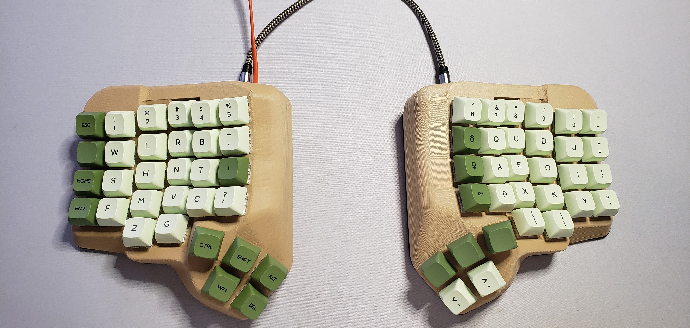
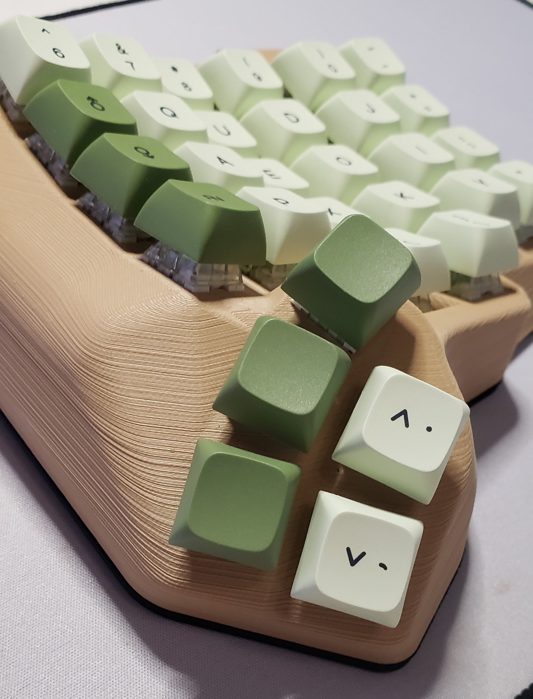
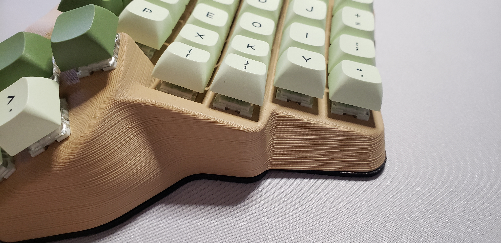
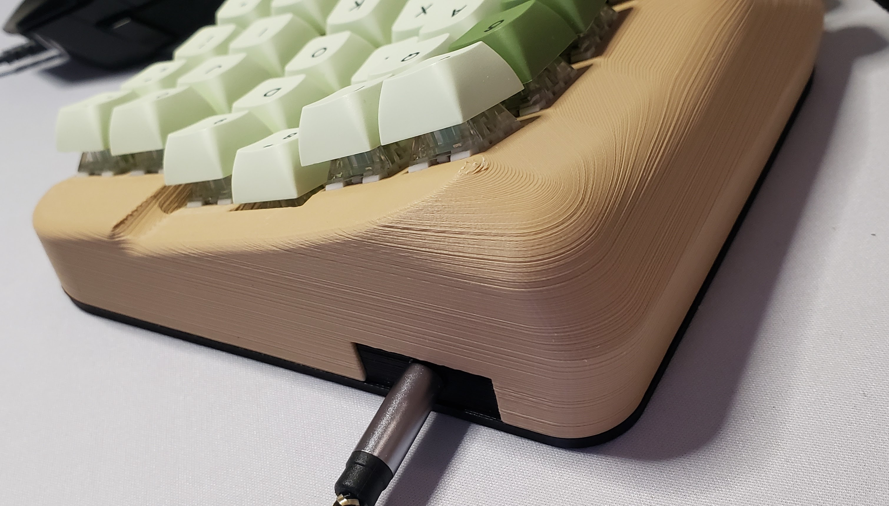
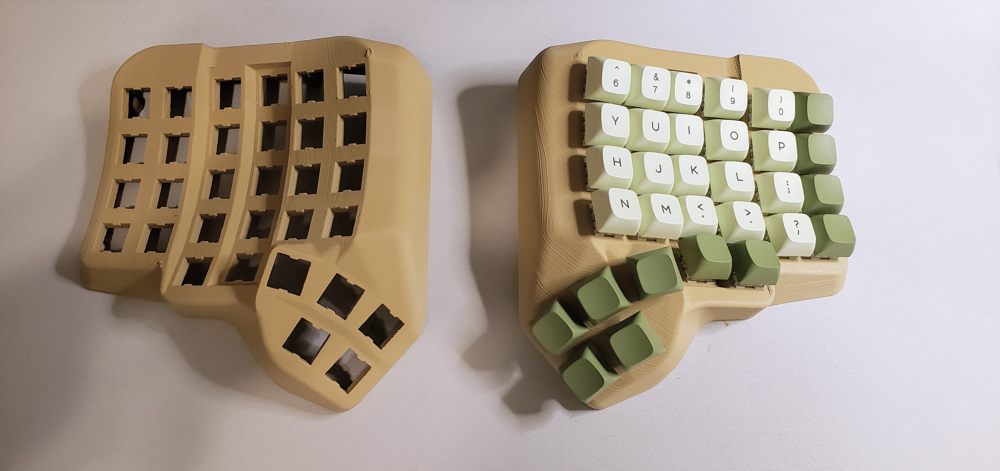
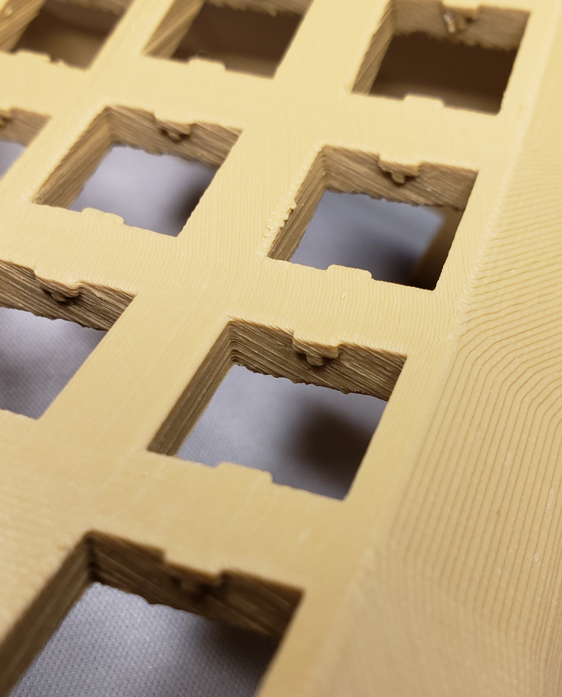
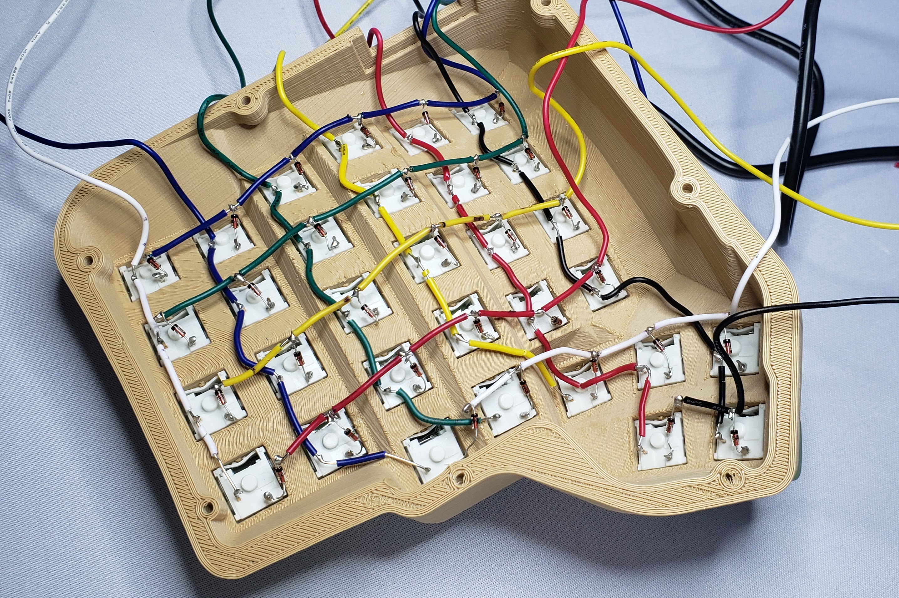

# Dactyl Manuform

## Description
This my variation of Dactyl Keyboard 5x6 with 5 keys for thumb cluster. I wanted to smooth out edges of the keyboard and that's what came out. 

# Keys
- **Keycaps:** PBT ZDA Match 
- **Khail Box Jades:** switches 
- **Layout:** [url=https://github.com/MadRabbit/halmak]Halmak[/url]

## Print parameters
- **Layer Height:** 0.12
- **Material:** Polly Terra PLA

## Pictures

